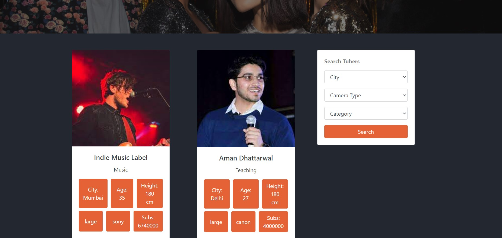

<h1 align="center">TUBERS</h1>


## Table of Contents:
- [Introduction](#Introduction)
- [To Run on Localhost](#LocalImplementation)
- [Technology Stack](#Technology-Stack)
- [Features](#Features)
- [Screenshots](#Screenshots)

## Introduction
We all know, businesses always look out for efficient ways to promote their products. Keeping that in mind, I
have created a web application
that mentions all the YouTuber’s details, like name, pricing, work, etc., in one place,
helping businesses sort Youtubers efficiently, according to their need, vision, and
budget.

## LocalImplementation
1. Clone the Repo and install dependencies
```
git clone https://github.com/freakfan15/Tubers.git
```
2. Install dependencies.
```
pip install requirements.txt
```
3. Start the server
```
python manage.py runserver
```


## Technology Stack
1) Django
2) PostgresSQL
3) HTML 
4) CSS
5) JavaScript
6) Bootstrap 5

## Features
1) All CRUD functionalities for creating, reading, updating and deleting information of different youtubers.
2) All the features can be directly controlled and customised by a custom built admin panel.
3) Implemented keyword based search.
4) Implemented authentication including OAuth Google login.
5) Contact form for reaching out to us.


## Screenshots
Home page

Featured Youtubers section

About Page

Keyword based search Section

Contact page

